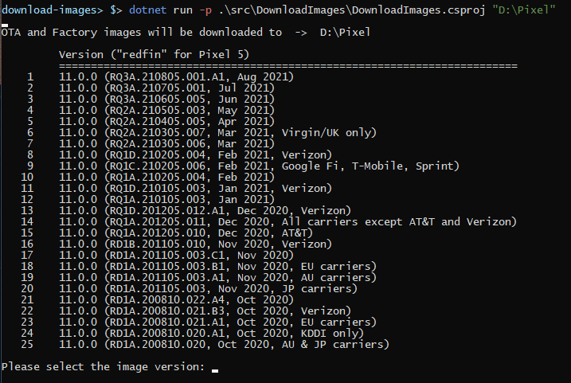
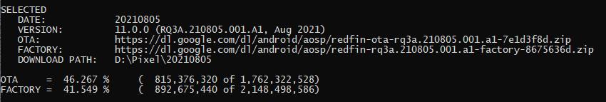
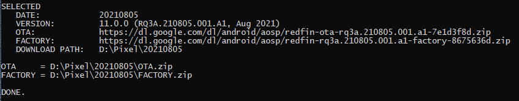

# download-pixel-images

A simple console app to download Google Pixel OTA and Factory images.

When applying an OTA update (and still retaining root with Magisk), you need the OTA zip file and the *boot.img* from the Factory image.  This app simplifies the process of obtaining the images.

## Build the app

```
dotnet build
```

## Run the app

```
dotnet run -p .\src\DownloadImages\DownloadImages.csproj "D:\Pixel"
```

**Menu**



**In Progress**



**Complete**

